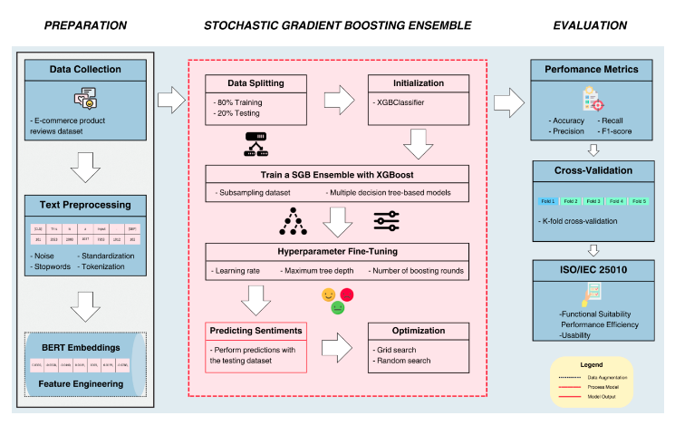
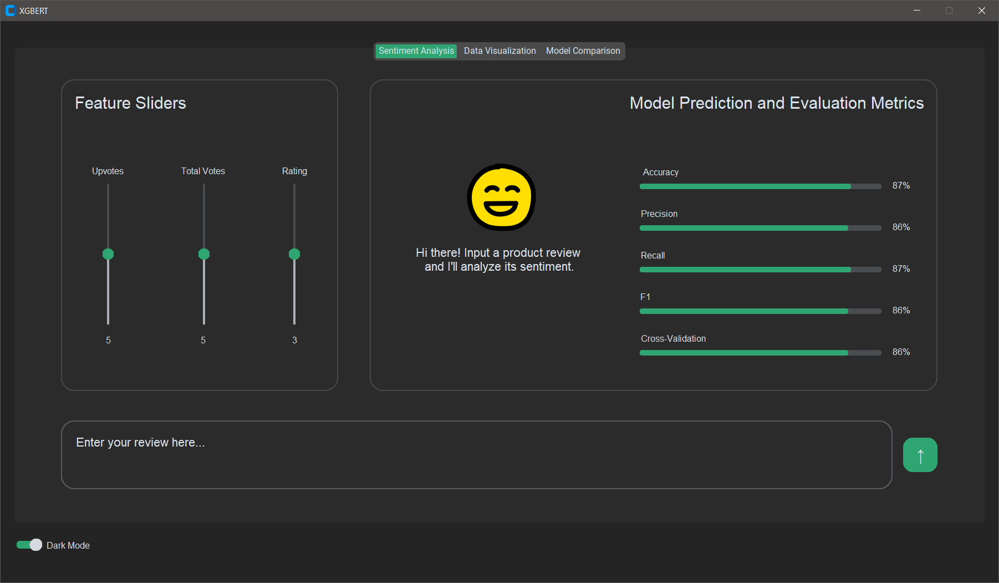
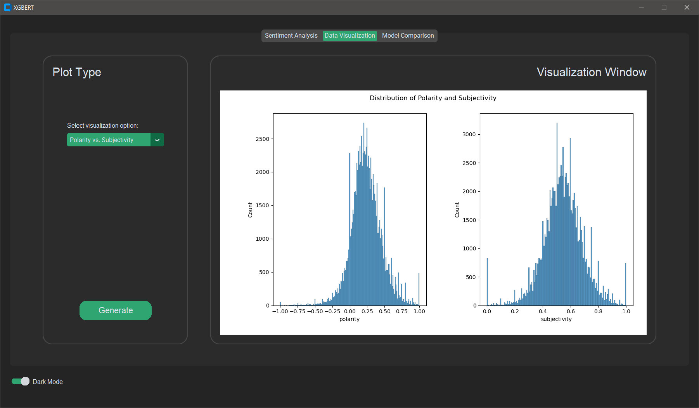
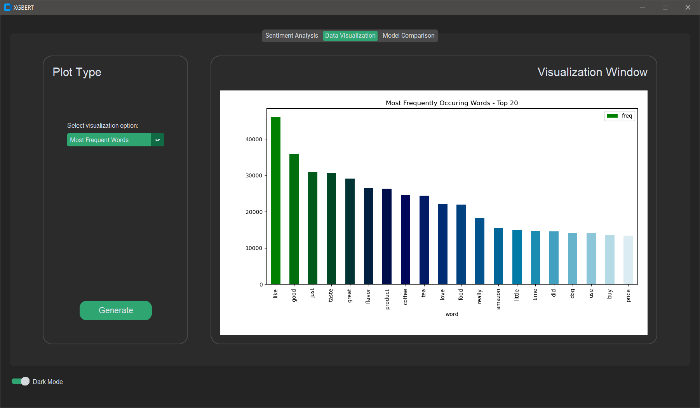
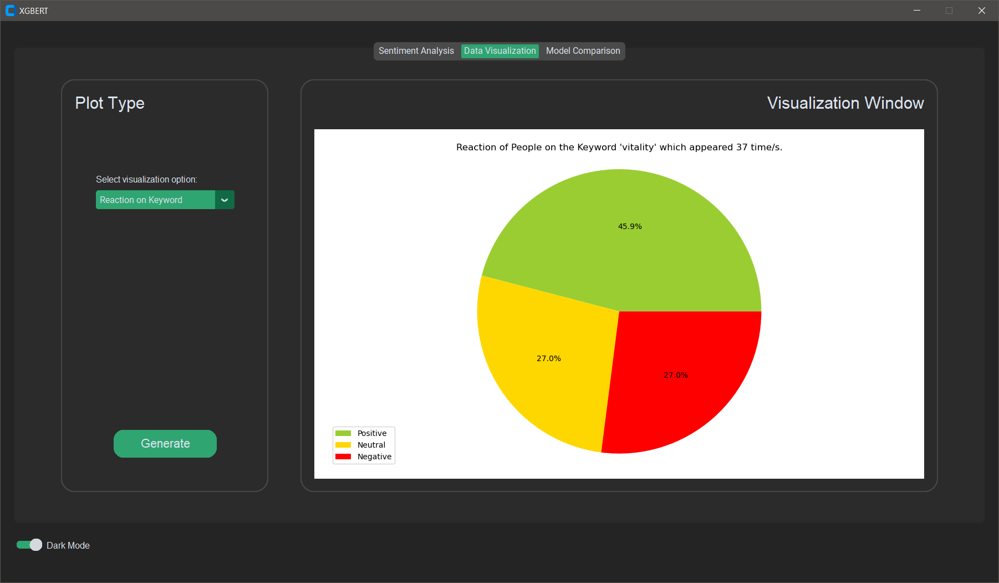
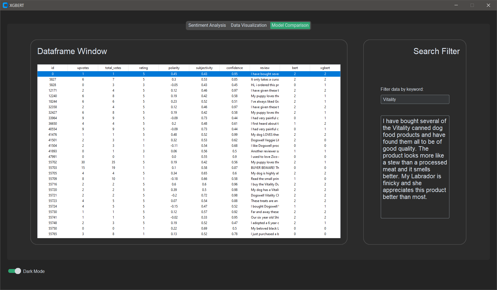

# Advancing E-commerce Sentiment Analysis

  

Authors: [Princess Angeles](https://www.linkedin.com/in/princess-rainbow-angeles-1894762ab/?originalSubdomain=ph) · [Ryan Caabay](https://www.linkedin.com/in/ryancaabay/) · [Aaron Lasala](https://www.linkedin.com/in/aaron-lasala-865155171/)

Dataset: [Amazon Product Reviews](https://www.kaggle.com/datasets/arhamrumi/amazon-product-reviews)

This is a code implementation of our thesis paper: "Advancing E-Commerce Sentiment Analysis: An Implementation of Bidirectional Encoder Representations from Transformers with Stochastic Gradient Boosting Ensemble"

Through a systematic approach, our study addresses challenges in the e-commerce industry, such as competition and customer satisfaction, by leveraging valuable customer reviews. The proposed system holds significance for technological advancement in sentiment analysis and contributes novel insights to the field of Data Science.

## Sentiment Analysis

  

## Feature Importance

  

## Polarity vs. Subjectivity

  

## Most Frequent Words

  

## Reaction on Keyword

  

## Model Comparison

  

